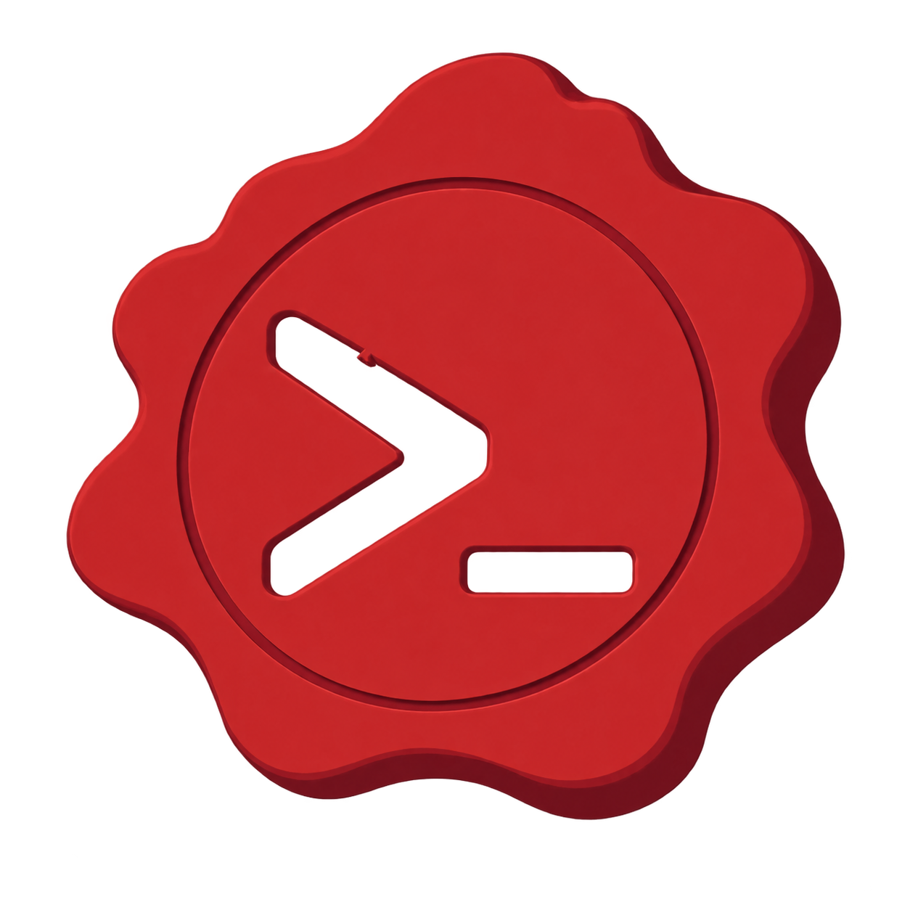
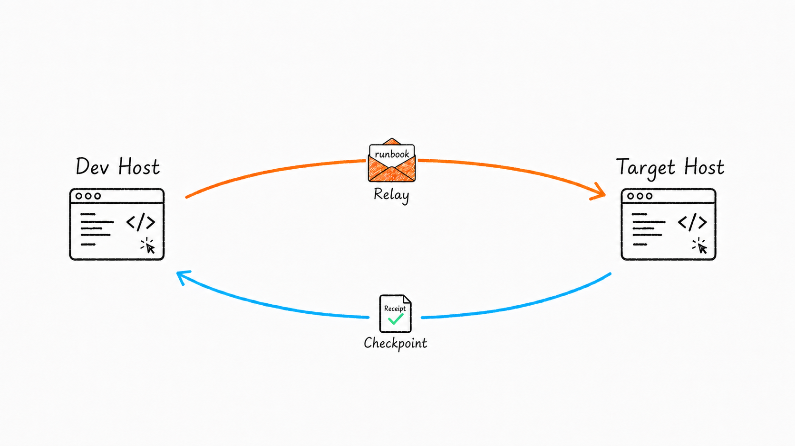

<h1 align="center">
  
  Code Relay
</h1>

<p align="center">
  <a href="README.md">English</a> · <a href="README.zh-CN.md">Chinese</a>
</p>

<h2 align="center">
  Build. Prove. Relay.
</h2>

> **Code Relay lets your coding agent develop on one machine and prove the result on another.**

Relay is an MCP-based coding-agent integration for cross-machine development and
verification. AI on the Dev Host implements the request; the Target Host runs
the real validation; a structured receipt comes back to guide the next repair
iteration. It works with Codex, Claude Code, Cursor, VS Code, and other
MCP-capable coding agents.

## When Relay is useful

- **Different environments** — develop on Windows or macOS, verify on Linux, a private network, or a production-like host.
- **Special hardware** — send model code to a CUDA/GPU machine, or verify a camera, serial device, or sensor where it is connected.
- **Real integrations** — exercise payment callbacks, queues, databases, browsers, or internal services that cannot be reproduced locally.
- **AI-driven iteration** — return concrete expected/actual results so the coding agent can repair, republish, and retry.

## What Relay provides

- Branch-scoped project binding and short-lived join links.
- Exact source-commit verification in an isolated worktree.
- Checkpoint execution through a `code-relay-checkpoint` GitHub Actions self-hosted runner.
- Safe, allowlisted validation commands with bounded output and timeouts.
- Structured `receipt.json` and human-readable receipts for passed, failed, and blocked runs.

## Quick start

### Option 1: Let your AI client install it

Give your MCP-capable coding agent the repository's [AI-client installation guide](install.md)
and ask it to follow the instructions. The guide previews changes, asks for
confirmation, preserves existing MCP servers, and pins the installed version.

### Option 2: Install with npm

```sh
npx -y code-relay-mcp@latest install --client codex
```

Replace `codex` with `claude-code`, `cursor`, `vscode`, or `generic` as needed.
For a persistent command:

```sh
npm install --global code-relay-mcp
code-relay-mcp install --client codex --yes
```

Node.js 18+ is required. The launcher downloads and verifies the matching
native release binary on first use; Go is not required at runtime. For client
options and recovery steps, see [install.md](install.md).

## How it works

<p align="center">
  
</p>

Accessible summary: the Dev Host sends a repository- and branch-bound runbook
through Relay; the Target Host checks the exact source commit in its real
environment and returns a Receipt recording the Checkpoint result.

Every runbook is bound to a repository, branch, and source commit. The Target
Host acts as the Checkpoint, and the resulting receipt records passed, failed,
or blocked verification for the next iteration.

## Documentation

- [Chinese README](README.zh-CN.md)
- [User guide](USER_GUIDE.md)
- [AI-client installation guide](install.md)
- [Local desktop install runbook](deploy/LOCAL-INSTALL-RUNBOOK.md)
- [Deployment and runbook](deploy/RUNBOOK.md)
- [Security](SECURITY.md)
- [Contributing](CONTRIBUTING.md)

## License

Code Relay is released under the [MIT License](LICENSE).
